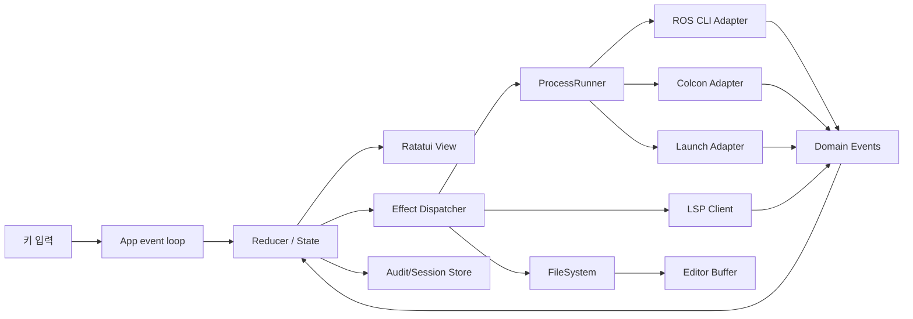
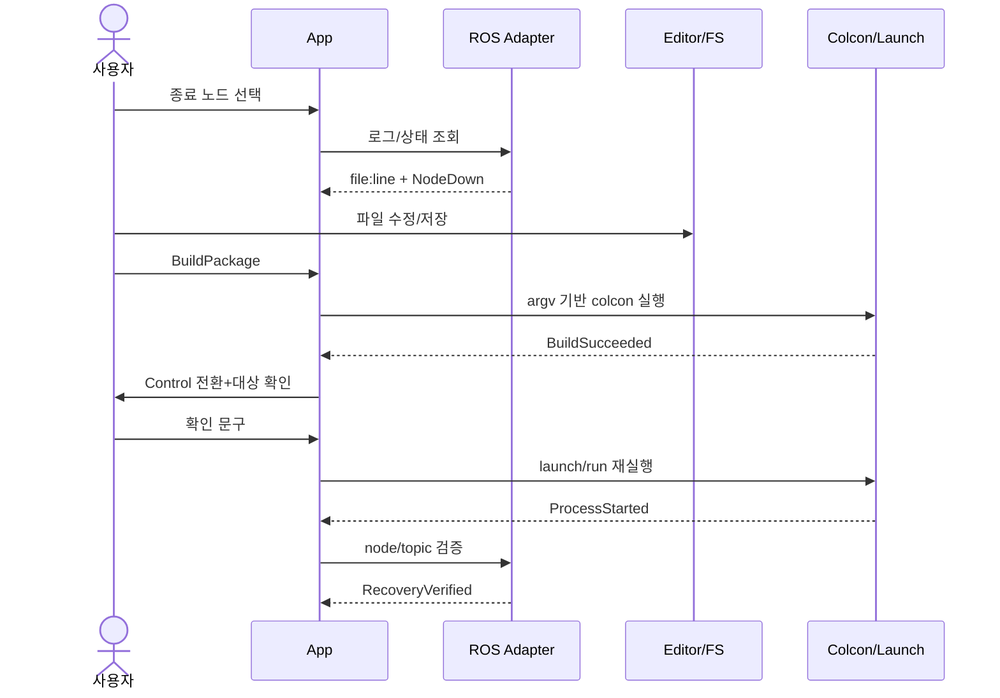
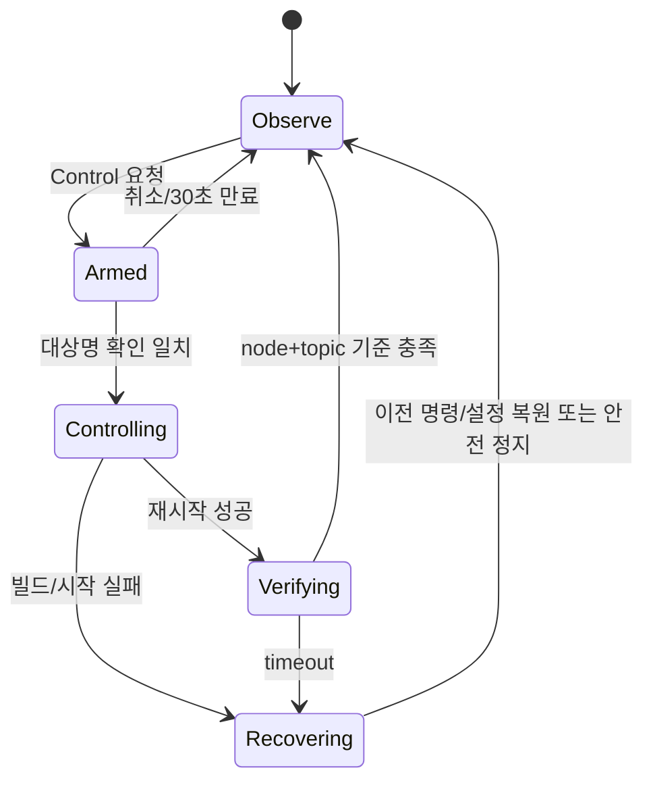

# 모바일 우선 ROS 2 터미널 IDE 계획서

> 문서 기준일: 2026-10-01 · 개정 조건: 1명, **잔여 10주**, 주 12~15시간(총 120~150시간)

## 0. 전제와 결정

- 가칭은 **FieldIDE**다. Android/Termux 자체에 ROS 2를 설치하는 제품이 아니라, Termux에서 사용자가 로봇 호스트에 `ssh`로 접속한 뒤 그 호스트에서 실행하는 단일 Rust 바이너리다.
- 기준 환경은 Ubuntu 24.04 + ROS 2 Jazzy LTS다. 다른 배포판은 fixture와 수동 시험으로 호환성을 확인한다. 배포판 수명과 Tier는 [Jazzy 공식 릴리스 문서](https://docs.ros.org/en/jazzy/Releases/Release-Jazzy-Jalisco.html)를 설치 시점에 다시 확인한다.
- Rust와 크레이트는 개발 시작일의 현재 안정 버전을 쓰고 `rust-toolchain.toml`과 `Cargo.lock`으로 확정한다. 숫자를 이 문서에서 추측하지 않는다. Cargo 설치는 [공식 Cargo 문서](https://doc.rust-lang.org/stable/cargo/getting-started/installation.html)를 따른다.
- MVP는 ROS 그래프를 직접 DDS로 읽지 않고 `ros2`/`colcon` 프로세스를 호출한다. SSH 클라이언트, PTY, 터미널 파서, Tree-sitter 파서는 직접 만들지 않는다.
- 실제 로봇 제어는 기본 금지다. 시작 상태는 `Observe`; `Control` 전환에는 대상 이름과 확인 문구가 필요하다.
- **10주 범위 잠금:** 7주차까지 복구 수직 흐름을 우선한다. 최소 LSP와 세션 JSON은 7주차 MVP가 통과한 경우에만 v0.1에 넣고, 아니면 기능 플래그 없이 v0.2로 이관한다. 실제 모터는 필요하지 않다.

## 1. 프로젝트 요약

| 항목 | 내용 |
|---|---|
| 프로젝트명 | FieldIDE: Mobile-first ROS 2 Recovery Console |
| 한 문장 | 80×24 SSH 터미널에서 장애 노드 발견→로그→편집→선택 빌드→재시작→토픽 검증을 한 흐름으로 수행하는 TUI다. |
| 문제 | 현장에서 노트북 없이 여러 CLI와 편집기를 오가면 맥락, 시간, 안전성이 나빠진다. |
| 사용자 | ROS 2 현장 엔지니어, 학생 로봇팀, 소형 로봇 운영자 |
| 대표 시나리오 | `/motor_controller` 종료를 탐지하고 로그의 `src/motor.cpp:84`를 열어 수정한 뒤 관련 패키지만 빌드·재실행하고 `/cmd_vel` 상태를 확인한다. |
| 완성 가치 | 5분 안에 재현 가능한 복구 흐름, 명령 기록, 실수 방지, 작은 화면 사용성 |
| 학습 가치 | TUI 루프, Rope, Unicode, 프로세스/PTY, 비동기, LSP, ROS CLI, 상태 머신과 테스트 대역을 한 수직 기능에서 학습한다. |
| 차이 | 범용 편집기나 ROS 대시보드가 아니라 “현장 복구 작업”에 맞춘 모바일 단일 패널·안전 게이트·fixture 기반 검증이다. 기존 도구를 대체하지 않고 조합한다. |
| 하지 말아야 할 조건 | 실시간 안전 제어 인증이 필요하거나, ROS 명령의 출력 형식을 고정할 수 없거나, 원격 호스트에 바이너리를 둘 수 없거나, GUI/대규모 편집이 핵심이면 중단한다. |

기존 `vim`+`tmux`+ROS CLI는 강력하지만 숙련과 수동 문맥 전환이 필요하고, VS Code Remote/RViz는 작은 전화 화면과 불안정한 망에 무겁다. FieldIDE의 차별성은 새 편집기 기능 수가 아니라 복구 단계의 연결과 안전한 기본값이다.

## 2. 문제 정의

### 환경, 현재 흐름, 근본 원인

사용자는 전화기와 블루투스 키보드 또는 Termux extra keys만 들고 로봇과 같은 LAN에 있다. 현재는 `ssh`, `ros2 node list`, `ros2 topic info`, 로그 파일/`journalctl`, `vim`, `colcon build --packages-select`, `ros2 run/launch`를 번갈아 쓴다. 화면 전환 중 대상 호스트·패키지·오류 줄을 잃고, 작은 화면에서 긴 출력이 밀리며, 연결 중단 시 전경 프로세스가 사라지고, 위험한 재시작을 잘못된 로봇에서 실행할 수 있다.

근본 원인은 (1) 진단 정보가 프로세스별 텍스트로 흩어짐, (2) 노드↔실행 파일↔패키지↔launch의 관계가 런타임에서 완전하지 않음, (3) CLI 출력이 안정적 API가 아님, (4) 모바일 터미널의 공간·입력·망 제약, (5) 관찰과 변경 권한의 경계 부재다. Job To Be Done은 “로봇을 안전하게 멈춘 상태에서 원인을 찾아 최소 변경하고, 실패하면 되돌리며, 정상 복귀의 증거를 남기는 것”이다.

### 해결 범위

- 해결: 로컬 워크스페이스 탐색/편집, ROS/로그 관찰, 명시적 매핑, 선택 빌드, 승인된 재시작, 검증 체크, 감사 로그.
- 제외: SSH 접속 자체, 완전한 IDE/LSP, RViz, rosbag 편집, fleet 관리, 원격 파일 동기화, 안전 인증, 임의 쉘.
- 불완전한 자동 매핑은 추측하지 않고 `fieldide.toml`의 사용자 선언으로 보완한다.

### 검증할 가설

1. 단일 패널 흐름이 기준 CLI 대비 중앙값 복구 시간을 30% 줄인다.
2. 80×24에서 핵심 정보 3단계 이내 접근이 가능하다.
3. ROS CLI fixture가 설치 없는 CI에서 파서 회귀의 90% 이상을 잡는다.
4. 재시작 확인과 Observe 기본값이 오조작을 줄인다.
5. tmux 재접속이면 자체 데몬 없이도 첫 릴리스 요구를 충족한다.

### 인터뷰 질문 10개

1. 마지막 현장 장애에서 첫 명령부터 복구까지 무엇을 했는가?
2. 노트북이 없었던 빈도와 대체 수단은?
3. 가장 자주 확인하는 node/topic/log 명령은?
4. 노드와 패키지·launch의 관계를 어디에 기록하는가?
5. 실패한 빌드 또는 재시작을 어떻게 되돌리는가?
6. 80×24에서 반드시 보여야 할 세 정보는?
7. SSH 단절 시 어떤 작업이 손실되는가?
8. 실제 로봇과 시뮬레이션을 어떻게 구분하는가?
9. 어떤 작업에 2차 확인이 필요한가?
10. 이 도구를 신뢰하려면 어떤 로그·증거·테스트가 필요한가?

### 성공 지표

| 지표 | 목표 |
|---|---|
| 종단 복구 시간 | 5명×2회 모의 과제 중앙값 5분 이하, 기준 CLI보다 30% 단축 |
| 조작 오류 | 잘못된 대상 재시작 0회; 위험 명령 무확인 실행 0회 |
| 작은 화면 | 80×24에서 잘림 없이 전 기능, 핵심 작업 키 입력 40회 이하 |
| 파서 품질 | 지원 배포판 fixture 100% 통과, 알 수 없는 출력은 크래시 대신 `Unknown` |
| 안정성 | 가짜 어댑터 2시간 soak에서 panic/태스크 누수 0 |
| 정성 | 사용자 4/5 이상이 “현장에서 다시 쓰겠다”, 실패 원인 설명 가능 |

## 3. 목표와 비목표

| 단계 | 완료 정의 |
|---|---|
| PoC(1~2주) | 80×24에서 파일을 열고 저장하며, fixture ROS 노드 목록과 로그를 표시하고, 키만으로 패널을 바꾼다. `cargo test --workspace`가 통과한다. |
| MVP(3~7주) | 실제 Jazzy에서 죽은 노드→오류 위치→YAML 수정→`colcon build --packages-select`→승인 재시작→노드/토픽 검증을 5분 내 완료한다. |
| v0.1(8~10주) | Linux aarch64/x86_64 바이너리, tmux 안내, 감사 로그, 80×24/느린 링크 및 Raspberry Pi 시험을 마치고 릴리스한다. 최소 LSP는 7주차 MVP 통과 시에만 포함한다. |
| v0.2+ | 직접 `rclrs`, 자체 세션 데몬, git 변경 UI, 더 많은 LSP 기능, rosbag/서비스/action, 플러그인 API를 별도 RFC 후 검토한다. |

명시적 비목표는 SSH 구현, 원격 배포, 협업 편집, 디버거, GUI, 모든 ROS 배포판 지원이다. 10주 안에는 자체 SSH·tmux 대체 데몬·DDS 클라이언트·완전한 LSP·Git staging UI·터치 UI·컨테이너 오케스트레이션을 절대 구현하지 않는다. 범위가 커지면 순서대로 (1) Rust 이외 LSP, (2) Rust/YAML 이외 Tree-sitter grammar, (3) 연속 토픽 주기 그래프(단발 샘플은 유지), (4) 자동 노드 매핑, (5) PTY 셸 패널, (6) git 요약을 제거한다. 파일 편집+fixture 진단+선택 빌드+안전 재시작+검증은 남긴다.

## 4. 기술 스택

| 영역 | 선택/이유 | 대안/배제 이유 | 직접 구현 / 위임 | 호환성 |
|---|---|---|---|---|
| 언어 | 안정 Rust; 단일 바이너리·메모리 안전 | Go는 좋지만 학습 목표 불일치 | 상태/도메인 직접, 표준 기능 위임 | MSRV는 v0.1 때 선언 |
| TUI | [Ratatui](https://ratatui.rs/) + [Crossterm](https://docs.rs/crossterm/); 백엔드 독립/Windows 지원 | Cursive는 레이아웃 제어가 덜 직접적 | 이벤트 루프/반응형 레이아웃 직접 | width/색/키가 터미널별 다름 |
| 비동기 | [Tokio](https://tokio.rs/); 프로세스·채널·타이머 | async-std 생태계 결합 약함 | 취소/상태 머신 직접 | 블로킹 FS를 UI 태스크에서 금지 |
| 텍스트 | [Ropey](https://docs.rs/ropey/) + unicode-width/segmentation | `String`은 큰 파일 편집 비용 | 편집 명령·selection·undo 직접 | byte/char/grapheme/셀 열 구분 |
| 구문 | [Tree-sitter](https://tree-sitter.github.io/tree-sitter/) | 정규식은 정확도 부족 | query/증분 갱신 결합 직접 | grammar ABI와 언어별 crate 고정 |
| LSP | `lsp-types`, `serde_json`, Tokio stdio | tower-lsp는 서버용 중심 | 최소 클라이언트 framing/요청 추적 직접 | 서버별 position encoding 협상 |
| ROS | `ros2` CLI 어댑터 | `rclrs`는 빌드/배포 결합 증가 | 실행·timeout·파싱 직접 | 배포판별 출력 fixture 필요 |
| 빌드 | `colcon` 호출; 공식 [선택 패키지 옵션](https://colcon.readthedocs.io/en/released/reference/package-selection-arguments.html) 사용 | 빌드 재구현 불가 | 명령 계획/허용 목록 직접 | workspace overlay/source 환경 |
| 프로세스 | Tokio process, 필요 시 `portable-pty` | 셸 문자열은 주입 위험 | argv 구성·취소 직접, PTY 위임 | POSIX signal/Windows 차이 |
| 설정 | `serde` + TOML | YAML은 설정 모호성 | schema/검증 직접 | unknown field 거부, 버전 필드 |
| CLI/로그 | `clap`, `tracing` | 수제 파서/println | 도메인 이벤트 직접 | 로그 경로·ANSI 처리 |
| Git | 안전한 `git` argv 호출, 읽기 전용 status/diff | 초기 `git2`는 네이티브 의존 | 허용 명령만 직접 | Git 버전/경로/CRLF |
| 세션 | v0.1은 `tmux` 권장 | 자체 데몬은 복구·인증 범위 큼 | 재접속 문서/상태 저장 직접 | tmux 없는 환경은 기능 저하 |
| 테스트 | built-in, proptest, insta, cargo-fuzz | 실기기만은 재현성 부족 | fixture/fake clock/runner 직접 | snapshot은 배포판별 분리 |

모든 의존성은 `cargo add` 시 현재 안정 버전을 선택하고 `Cargo.lock`을 커밋한다. ROS 명령 인자 규칙은 [ROS 2 CLI 설계](https://design.ros2.org/articles/ros_command_line_arguments.html), launch 의미는 [공식 launch 설계](https://design.ros2.org/articles/roslaunch.html)를 기준으로 한다.

세션 전략은 다음처럼 결정한다.

| 선택 | 장점 | 비용/제약 | 결정 |
|---|---|---|---|
| `tmux new -As fieldide` | 검증된 재접속, 장시간 build/launch 생존, 구현 비용 거의 없음 | 원격 Linux에 tmux 필요, 앱 상태 자체 복원은 제한 | **v0.1 기본** |
| 자체 세션 데몬 | 앱 상태/작업 queue를 정밀 복원 가능 | 인증, socket 권한, daemon upgrade, 고아 작업, Windows service까지 범위 확대 | v0.2 RFC 전 구현 금지 |
| 앱 상태 JSON만 저장 | 열린 파일/패널/대상 복원, tmux 없이도 일부 회복 | 실행 중 child는 살아남지 않음 | v0.1 보조 수단 |

## 5. 선수 지식과 학습 계획

먼저 알아야 할 것은 ownership/borrow, `Result`, enum pattern matching, 파일/프로세스, 터미널 raw mode, ROS node/topic/package다. async 취소, Rope, LSP, Tree-sitter는 구현 중 학습해도 된다.

| 학습 주제 | 필요한 이유 | 실습 | 이해 확인 기준 | 적용 기능 |
|---|---|---|---|---|
| Rust ownership/trait | 어댑터와 상태 분리 | 메모리 fake 구현 | 실제/fake runner를 같은 trait로 교체 | 전 모듈 |
| `Result`/thiserror | 복구 가능한 오류 | 오류 chain 출력 | panic 없이 UI 오류로 변환 | 오류 전파 |
| grapheme/셀 폭 | 한글 커서 정확성 | `가🙂é` 이동/삭제 | grapheme 단위 이동, 셀 열 일치 | 편집기 |
| Rope/undo | 큰 텍스트와 역연산 | 1MB 편집 벤치 | 삽입·삭제 왕복 동일 | 버퍼 |
| 터미널 raw/alternate screen | 안전한 TUI 종료 | 강제 오류 후 복원 | 커서/echo 정상 복구 | 앱 셸 |
| Tokio select/cancel | UI 비차단 | 느린 child 취소 | UI 100ms 내 반응, 자식 종료 | 프로세스 |
| OS process/signal | 빌드·노드 수명 | stdout/stderr 동시 캡처 | deadlock 없이 exit 수집 | runner |
| ROS graph/CLI | 상태 해석 | demo_nodes 조사 | node/topic/publisher 수 설명 | ROS 패널 |
| colcon overlay | 선택 빌드 | 2패키지 workspace | `--packages-select`와 `--packages-up-to` 차이 설명 | 빌드 |
| LSP JSON-RPC | 진단 연결 | initialize/open/change | request id와 notification 구분 | 진단 |
| Tree-sitter 증분 파싱 | 강조 | 한 줄 수정 전후 tree | edit 범위를 올바로 갱신 | 강조 |
| 상태 머신/보상 | 안전 복구 | 실패 transition 표 | 불법 전이 거부 테스트 | 재시작 |
| threat modeling | 명령 주입 방지 | 악성 패키지명 입력 | argv 기반 실행·경로 경계 보장 | 안전 |

권장 원문: [Rust Book](https://doc.rust-lang.org/book/), [Tokio tutorial](https://tokio.rs/tokio/tutorial), [LSP specification](https://microsoft.github.io/language-server-protocol/specifications/lsp/3.17/specification/), [Tree-sitter 문서](https://tree-sitter.github.io/tree-sitter/), [ROS 2 tutorials](https://docs.ros.org/en/jazzy/Tutorials.html), [colcon 문서](https://colcon.readthedocs.io/en/released/).

## 6. 시스템 아키텍처



동기 경계는 순수 reducer, Rope 편집, 레이아웃 계산이다. 파일 I/O, child process, 타이머, LSP는 Tokio 태스크이며 bounded `mpsc`로 `AppEvent`를 보낸다. UI는 50ms tick 또는 이벤트 시 렌더하고 최신 상태만 그려 느린 SSH의 diff를 줄인다. blocking 파싱은 `spawn_blocking`; TUI 렌더는 단일 스레드다. 오류는 `DomainError`로 분류해 이벤트가 되며, fatal terminal 오류만 최상위로 전파한다.



이벤트 흐름은 `Input → Command → Effect → Event → reduce → render` 단방향이다. 주요 상태 머신은 다음과 같다.



복구는 child 취소→종료 확인→마지막 저장 전 파일 backup은 만들지 않고 Git diff 안내→이전 launch 명령이 알려진 경우만 재실행→불명확하면 Observe로 돌아가 사용자에게 수동 명령을 보여준다. 확장점은 `ProcessRunner`, `RosInspector`, `BuildService`, `Launcher`, `FileStore`, `Clock`. 플랫폼 의존 terminal/signal/path는 `platform/{unix,windows}.rs`에 격리한다.

## 7. 데이터 구조와 핵심 인터페이스

```rust
pub struct AppState { pub mode: SafetyMode, pub panel: Panel, pub target: Target,
  pub workspace: Workspace, pub editor: EditorState, pub ros: RosSnapshot,
  pub operation: OperationState, pub notices: Vec<Notice> }
pub struct Target { pub label: String, pub host: String, pub environment: EnvironmentKind }
pub enum EnvironmentKind { Simulation, Robot }
pub enum SafetyMode { Observe, Armed { expires_at: Instant }, Control }
pub enum Panel { Dashboard, Files, Editor, Logs, Build, Verify, Palette }
pub struct TextBuffer { rope: Rope, revision: u64, dirty: bool, undo: Vec<EditTxn>, redo: Vec<EditTxn> }
pub struct Cursor { pub grapheme: usize, pub preferred_column: u16 }
pub struct NodeInfo { pub fqn: String, pub status: NodeStatus, pub mapping: Option<NodeMapping> }
pub enum NodeStatus { Running, Missing, SuspectedDead, Unknown(String) }
pub struct NodeMapping { pub package: String, pub executable: String, pub launch: Option<PathBuf> }
pub struct TopicInfo { pub name: String, pub publishers: u32, pub subscribers: u32, pub hz: Option<f64> }
pub enum OperationState { Idle, Running { id: OpId, kind: OpKind }, Verifying(VerifyPlan), Failed(DomainError) }
pub enum Command { Open(PathBuf), Edit(EditCommand), Save, RefreshRos, BuildPackage(String),
  ArmControl, ConfirmControl(String), Restart(NodeId), Cancel(OpId), Verify(VerifyPlan) }
pub enum AppEvent { Input(KeyEvent), Tick, FileLoaded(Document), Saved,
  RosSnapshot(RosSnapshot), ProcessOutput(OpId, Stream, Bytes), OperationFinished(OpId, Exit),
  DiagnosticBatch(Uri, Vec<Diagnostic>), Error(DomainError) }
#[derive(thiserror::Error, Debug)]
pub enum DomainError { Io(std::io::Error), OutsideWorkspace(PathBuf), InvalidUtf8,
  ToolMissing(&'static str), Timeout(OpKind), Parse{tool:String, sample:String},
  UnsafeOperation(String), ChildFailed{code:Option<i32>, stderr:String}, Protocol(String) }
#[async_trait]
pub trait ProcessRunner { async fn run(&self, spec: ProcessSpec, sink: EventSink) -> Result<Exit, DomainError>; }
pub trait RosOutputParser { fn parse(&self, kind: RosQuery, bytes: &[u8]) -> Result<RosData, DomainError>; }
pub trait FileStore { fn read(&self, path: &WorkspacePath) -> Result<Vec<u8>, DomainError>;
  fn atomic_write(&self, path: &WorkspacePath, data: &[u8]) -> Result<(), DomainError>; }
pub trait Reducer { fn reduce(&mut self, command: Command) -> Vec<Effect>; }
```

불변 조건: 경로는 canonical workspace 내부이고 symlink 탈출이 없다. `revision`은 변경마다 단조 증가한다. dirty 문서는 명시 확인 없이 닫지 않는다. `Control`은 Robot 대상에서 만료되는 확인 토큰 없이는 진입하지 않는다. 프로세스는 셸 문자열이 아닌 executable+argv다. 동시에 한 build/restart만 존재한다. 오래된 작업 이벤트는 `OpId`로 버린다. 로그/설정 JSON은 `schema_version`, 시간, redacted argv, 결과를 직렬화하고 토큰·환경 변수 값은 저장하지 않는다.

## 8. 저장소와 디렉터리 구조

```text
fieldide/
├── Cargo.toml                 # workspace, 공통 lint/metadata
├── Cargo.lock
├── rust-toolchain.toml
├── crates/
│   ├── fieldide-core/         # 상태, 명령, 이벤트, 안전 정책(순수)
│   ├── fieldide-editor/       # Rope 편집/undo/search
│   ├── fieldide-adapters/     # fs/process/ROS/colcon/LSP
│   └── fieldide-tui/          # binary, input, layout, widgets
├── fixtures/ros/{jazzy,fake}/ # 정제된 stdout/stderr와 기대 JSON
├── tests/e2e/                 # fake executable 기반 종단 시험
├── examples/fieldide.toml
├── docs/{architecture,safety,compatibility}.md
└── .github/{workflows,ISSUE_TEMPLATE}/
```

처음부터 네 crate인 이유는 순수 core/editor를 ROS 없는 CI에서 시험하고, side effect와 UI 의존성을 역전하기 위해서다. 그러나 기능별 crate는 만들지 않는다. 한 모듈이 1,000줄을 넘고 독립 API·독립 테스트·의존 경계가 세 번 이상 확인되기 전에는 분리하지 않는다.

## 9. 10주 상세 일정

각 주 12~15시간이며 학습 2~3, 구현 7~10, 테스트·문서 2~3시간을 기본으로 한다. 일정 방어를 위해 7주차 종료 때 종단 흐름이 완성되지 않으면 LSP와 구문 강조를 v0.2로 이동한다.

| 주 | 목표·학습 | 구현·산출물 | 실험·테스트·수동 검증 | 완료 기준 | 위험 및 축소안 / 의존성 |
|---:|---|---|---|---|---|
| 1 (12~15h) | 문제/안전, Rust trait·TUI raw mode, Unicode | workspace, reducer, TerminalGuard, 80×24 shell, Rope open/atomic save/cursor | resize/key/terminal restore, 한글·emoji·CRLF | `cargo run -p fieldide-tui -- --demo`; `cargo test --workspace`; 80×24에서 한글 파일 수정·저장 | selection/여러 파일은 2주로 이동 / 2주 기반 |
| 2 (12~15h) | undo transaction, 검색, Tree-sitter 사용법 | undo/redo, literal search, 3개 문서, Rust/YAML 강조, workspace sandbox | 100회 undo property, traversal/symlink, 1MB 파일 | `cargo test -p fieldide-editor`; 3파일 열기·검색·저장, highlight snapshot | 구문 강조는 단일 언어 또는 plain text / 프로세스 기반 |
| 3 (12~15h) | child process, pipe, 취소, ROS graph | `ProcessRunner`, fake executable, node/topic list/info 파서, fixture metadata | 폭주·timeout·cancel·CRLF·unknown line | fake `ros2` PATH로 node/topic Dashboard snapshot; UI가 멈추지 않음 | topic hz 제외, counts만 / 로그 |
| 4 (12~15h) | 로그/위치와 명시적 매핑 | bounded log tail, `path:line:col`, `fieldide.toml` node→package/executable/launch | ANSI·공백 경로·회전 로그·손상 TOML | 죽은 가짜 노드→로그→정확한 파일/줄 열기 자동 시험 | journalctl 자동 발견 제거 / build |
| 5 (12~15h) | colcon overlay/실패 해석 | package discovery, 선택 build, build panel, 실패 위치 | fake colcon 성공/실패/취소; 작은 Jazzy workspace 실제 build | `colcon build --packages-select demo_pkg` argv golden; 실제 선택 패키지 build 성공 | `--packages-up-to`는 팔레트 고급 옵션 / restart |
| 6 (12~15h) | 안전 상태 머신과 process lifecycle | Observe/Armed/Control, 대상 배너, audit, run/launch, SIGINT→kill | 확인 만료/오타/즉시 종료/고아/포트 충돌 | Robot restart가 확인 전 0회; fake 노드 start/stop과 실패 시 Observe | launch config 방식만, 자동 lifecycle/compose 제외 / verify |
| 7 (12~15h) | 복구 판정과 종단 통합 | node 존재+topic pub/sub+선택적 단발 hz `VerifyPlan`, rollback 안내 | 지연 등장/flapping/timeout; 전체 fixture | 죽은 노드→수정→build→restart→verify e2e가 5분 내 통과 | hz를 제거하고 publisher count만 유지 / MVP freeze |
| 8 (12~15h) | 최소 LSP·모바일 UX·세션 | Rust 또는 YAML 서버 하나의 diagnostics, palette/help, compact render, tmux/session JSON | fragmented JSON-RPC, stale revision, 80×24/200ms | 진단 선택→줄 이동, 서버 부재 graceful, 키보드만으로 전 흐름 | 7주 MVP 미완이면 LSP 전체를 v0.2로 이동 / 하드웨어 RC |
| 9 (12~15h) | Raspberry Pi/Jazzy 실환경, 보안·성능 | aarch64 release, install script/문서, threat fixes | Pi에서 2시간 soak, symlink/injection/redaction, 전화 SSH 단절/재접속 | Pi에서 실제 demo package 종단 복구 3회; p95/RSS 기록; 고아 0 | 실제 모터 제외, 가상 motor node 사용 / release |
| 10 (12~15h) | 사용자 시험/릴리스/발표 | README, compatibility/safety, binary/checksum, demo fixture/영상 | clean install, 3명 과제, 2회 rehearsal | 2/3 이상 5분 내 성공, 모든 release gate 통과, GitHub v0.1 | 미완 stretch 기능은 비활성·v0.2 이관 / 종료 |

## 10. 단계별 실습

| 실습(시간) | 목적·최소 구현 | 관찰/이해 기준 | 흔한 실수 | 귀결 |
|---|---|---|---|---|
| Raw-mode guard(2h) | alternate screen 진입 후 panic에도 복원 | echo/커서 복구 | Drop 누락 | `TerminalGuard`로 발전 |
| Grapheme pad(2h) | 한글/emoji 한 줄 편집 | byte≠char≠cell 설명 | `len()`을 열로 사용 | editor 테스트로 편입 |
| Child pump(3h) | 두 스트림 동시 읽기·취소 | pipe deadlock 없음 | stderr 미소비 | runner로 발전 |
| Fake `ros2`(3h) | argv별 fixture 출력 | 실제 CLI 없이 동일 파서 | 셸 script에 결합 | e2e 핵심 fixture |
| JSON-RPC framing(3h) | Content-Length 메시지 2개 | 분할 read 처리 | 한 read=한 message 가정 | LSP transport로 발전 |
| Safety reducer(2h) | 표 기반 상태 전이 | 불법 전이 모두 오류 | UI에서만 차단 | core로 발전 |
| tmux disconnect(1h) | build 중 SSH 종료/재접속 | child 생존 여부 기록 | 로컬 tmux 착각 | 실습 코드는 버리고 문서화 |

## 11. 테스트 전략

| 종류 | 대상/입력/기대 | 도구 | 자동화/CI |
|---|---|---|---|
| 단위 | reducer, editor, parser 경계값 | Rust test | 매 PR |
| 속성 | edit↔undo, 경로 정규화, 상태 전이 | proptest | 매 PR(축소 case 저장) |
| 통합 | fake ros2/colcon/LSP 프로세스 | assert_cmd/tempfile | Linux/Windows CI |
| 골든 | 80×24 화면, argv, 파서 JSON | insta | 매 PR, 명시 review |
| 퍼징 | CLI bytes, location parser, TOML | cargo-fuzz | 야간/릴리스 전 10분 |
| 성능 | render, Rope, bounded log | criterion/custom | main 추세 |
| 안정성 | 2h refresh/build cancel 반복 | fake clock + soak | 주간 |
| 오류 주입 | timeout, partial write, killed child | fake runner/store | 매 PR |
| 플랫폼 | Linux x64/aarch64, Windows 개발 | GitHub Actions | 매 PR/릴리스 |
| 사용자 | 5분 복구 과제 | 화면 녹화/관찰지 | v0.1 전 수동 |

대표 케이스(최소 15): (1) x0가 아닌 빈 node 목록, (2) CRLF node 출력, (3) 알 수 없는 ROS 행, (4) stdout 비UTF-8, (5) 10MB 로그 bounded, (6) stderr와 stdout 교차, (7) child timeout, (8) cancel 후 고아 없음, (9) `../` 경로 거부, (10) symlink 탈출 거부, (11) 공백/세미콜론 패키지명이 argv 한 항목, (12) atomic save 실패 시 원본 보존, (13) 한글 grapheme 삭제, (14) undo/redo 왕복, (15) resize 79×23에서 경고, (16) stale LSP 진단 폐기, (17) Control 확인 오타/만료 거부, (18) 동시 restart 거부, (19) breakpoint가 아닌 node 검증 timeout, (20) node OK/topic publisher 0이면 실패, (21) build failure 위치 열기, (22) session schema 구버전 안전 거부.

## 12. 성능 목표

모두 **초기 가설**이며 9주 측정 후 조정한다. Ubuntu 24.04, 4코어 ARM64 4GB와 x86_64 노트북, 80×24, `tc netem` 200ms 조건을 기록한다. idle CPU <2%, RSS <80MiB, key-to-render p95 <50ms(로컬)/<150ms(지연 링크), 1MB 파일 open <300ms, 10k 로그 append p95 <20ms, ROS refresh 2초 timeout, 화면 갱신 평균 <20KiB/s를 목표로 한다. criterion 결과를 main 기준 ±20% 경고로 비교한다. p95가 두 번 연속 초과하거나 사용자 입력이 끊길 때만 최적화하며, Tree-sitter query, Rope 내부, Tokio 스케줄러는 미리 최적화하지 않는다.

## 13. 보안 및 안전

신뢰 경계는 사용자↔FieldIDE↔workspace/child process↔ROS graph다. ROS 이름·로그·파일·TOML은 모두 외부 입력이다. FieldIDE는 권한 상승하지 않고 현재 SSH 사용자 권한만 사용한다.

| 위협 | 대응 |
|---|---|
| 패키지명 명령 주입 | 셸 금지, 고정 executable+분리 argv, 발견된 이름과 config schema 검증 |
| workspace 탈출/심볼릭 링크 | canonicalize 후 root prefix 확인, 새 파일은 부모 검증 |
| 실제 로봇 오조작 | Observe 기본, SIM/ROBOT 고정 배너, 대상명 재입력, 30초 만료 |
| 악성/거대 출력 DoS | child timeout, 줄/바이트 ring buffer, 파서 한도 |
| 로그 비밀 노출 | 환경값/토큰 redaction, 권한 0600, opt-in export |
| 손상 설정/세션 | schema version, unknown field 거부, 크기 제한, 안전 모드 시작 |
| TOCTOU 파일 교체 | 저장 직전 metadata 재검증, temp+fsync+rename, 충돌 알림 |
| 재시작 후 위험 동작 | 모터 명령 발행 기능 없음; health 기준만 읽기; E-stop 대체 금지 |
| 프로세스 잔류 | process group, SIGINT→grace→kill, PID만 신뢰하지 않고 handle 보유 |
| 의존성 공급망 | lockfile, cargo audit/deny, 최소 feature, 릴리스 provenance/checksum |

삭제, force build/clean, Robot 재시작, Control 전환은 사용자 확인 대상이다. 비밀, 전체 환경, SSH 키, ROS_SECURITY 키는 로그에 남기지 않는다.

## 14. 디버깅 전략

`tracing`에 `session_id/op_id/component/target` 필드를 넣고 기본 INFO, `RUST_LOG`로 DEBUG/TRACE를 켠다. 개발 빌드에는 reducer 불변조건과 task registry 누수 검사를 둔다. `:dump-state`는 비밀을 제거한 JSON, 실패한 외부 호출은 argv·exit·제한된 stdout/stderr·fixture hash를 저장한다. panic hook은 터미널을 먼저 복구하고 backtrace 경로를 알린다. Linux는 `RUST_BACKTRACE=1`, 필요 시 `gdb --args target/debug/fieldide ...`; Windows는 rust-lldb/WinDbg를 쓴다. 최소 재현은 실제 ROS 출력을 `fixtures/inbox`로 캡처→redact→단일 parser test로 줄인다. 디버깅 기능은 redaction golden, terminal guard panic test, dump schema round-trip으로 자체 시험한다.

## 15. 개발 환경

### 공통 및 Linux/WSL2

```bash
rustup toolchain install stable --component rustfmt clippy
rustc --version
cargo --version
cargo build --workspace
cargo test --workspace --all-features
cargo fmt --all -- --check
cargo clippy --workspace --all-targets --all-features -- -D warnings
cargo run -p fieldide-tui -- --demo --fixture fixtures/ros/jazzy
```

ROS 호스트에서는 `printenv ROS_DISTRO`, `ros2 --help`, `colcon --help`, `ros2 node list`, `ros2 topic list`로 확인한다. 선택 빌드는 `colcon build --packages-select <package>`이며 의존성까지 필요하면 공식 문서대로 `--packages-up-to`를 쓴다. 실행 전에 해당 배포판과 workspace의 `install/setup.bash`가 source되어 있어야 한다.

Windows 네이티브는 편집/core/fixture 시험만 지원하고 실제 ROS 종단 시험은 WSL2/Ubuntu 또는 로봇 호스트에서 한다. PowerShell 확인 명령은 `rustc --version`, `cargo test --workspace`; ANSI/키 차이를 Windows CI에서 검증한다. Termux는 SSH 접속과 키 입력만 담당한다. `tmux new -As fieldide` 후 원격에서 바이너리를 실행한다.

### 최소 ROS 2 시험 장비

실제 바퀴나 모터가 달린 로봇은 필수가 아니다. Raspberry Pi 한 대에서 `/motor_controller` 역할을 하는 가짜 ROS 2 package를 실행하면 node 종료, 로그, YAML 수정, 선택 build, launch 재시작, topic 복구까지 전부 시험할 수 있다.

| 등급 | 기준 | 판정 |
|---|---|---|
| 절대 최소(이미 보유한 경우) | 64-bit ARM CPU, RAM 2GB, 저장공간 여유 16GB 이상, 64-bit Ubuntu Server 24.04, 유선 LAN 또는 안정적인 5GHz Wi-Fi | demo node와 미리 빌드한 FieldIDE 실행은 가능. GUI를 설치하지 않고 build 병렬도를 1로 제한해야 함 |
| **새 제품 최소 구매** | **Raspberry Pi 5 Model B 2GB**, 32GB 이상 A2/high-endurance microSD, 정격 5V/5A(27W) USB-C, active cooler, Gigabit Ethernet 또는 5GHz Wi-Fi | 본 프로젝트 최소 기준. Jazzy `ros-base`, release FieldIDE, 작은 1~2 package workspace를 운용하되 FieldIDE 자체 Rust build는 PC/CI에서 수행 |
| 기존 장비 권장 | **Raspberry Pi 4 Model B 4GB**, 32GB 이상 저장장치, 정격 5V/3A USB-C, 방열판/통풍 | 이미 가지고 있거나 중고 가격이 좋다면 충분함. 새 제품 가격이 Pi 5 2GB보다 비싸면 선택할 이유가 적음 |
| 여유 있는 권장 | **Raspberry Pi 5 4GB**, 32GB 이상 저장장치, 공식급 5V/5A(27W) 전원, active cooler | 반복 `colcon build`, compiler와 ROS 동시 실행이 편함. 8GB는 이 프로젝트에 불필요 |
| 비권장 | Pi Zero/Zero 2 W, Pi 3의 1GB 구성, 32-bit OS, 불명확한 전원·노후 저가 microSD | 메모리/빌드/저장장치 지연이 제품 문제와 시험 장비 문제를 섞음 |

Raspberry Pi 4는 공식 사양상 64-bit quad-core Cortex-A72, 1~8GB RAM, Gigabit Ethernet과 5GHz Wi-Fi를 제공하고 5V/3A 전원을 요구한다. Pi 5는 2.4GHz quad-core Cortex-A76과 1GB 이상 RAM을 제공하며 고부하에서는 5V/5A 전원과 active cooling이 권장된다. 2026년 메모리 가격 인상으로 새 Pi 4/5의 고용량 모델 가격이 크게 올랐으므로, 이 프로젝트만을 위한 신규 구매는 Pi 5 2GB를 우선 비교한다. 구매 전 [Pi 4 공식 사양](https://www.raspberrypi.com/products/raspberry-pi-4-model-b/specifications/), [Pi 5 공식 사양](https://www.raspberrypi.com/products/raspberry-pi-5/), [공식 가격 변경 공지](https://www.raspberrypi.com/news/price-increases-for-2gb-raspberry-pi-4-and-raspberry-pi-5/)를 다시 확인한다.

OS는 ROS 2 Jazzy의 기준 조합에 맞춰 **Ubuntu Server 24.04 64-bit**를 권장한다. Raspberry Pi OS에서 컨테이너로 돌리는 방법도 있지만 10주 프로젝트에서는 환경 변수를 하나 더 늘리므로 제외한다. ROS 설치 시 Desktop 전체 대신 `ros-jazzy-ros-base`와 데모에 필요한 package만 설치하고, 설치 절차는 [ROS 2 Jazzy Ubuntu 공식 문서](https://docs.ros.org/en/jazzy/Installation/Ubuntu-Install-Debs.html)를 따른다.

최소 네트워크 조건은 전화와 Pi가 같은 IP 네트워크에 있고 전화에서 Pi의 TCP 22번 SSH에 접근 가능해야 한다. DDS discovery가 필요한 것은 Pi 내부 프로세스끼리뿐이므로 처음에는 모든 ROS node를 Pi에서 실행해 공유기 multicast 문제를 피한다. Wi-Fi 끊김 시험을 위해 유선 Ethernet을 기준선으로 한 번 성공시킨 뒤 Wi-Fi로 반복한다.

물리 출력까지 보여주고 싶다면 LED 또는 전원 분리된 저전압 소형 모터+적절한 driver를 선택 과제로 붙인다. 움직이는 차체, 프로펠러, 고전류 모터는 v0.1 검증에 필요하지 않다. 물리 actuator 시험은 독립 전원 차단 수단을 두고 사람이 닿지 않는 고정 지그에서만 하며, FieldIDE를 비상 정지 장치로 취급하지 않는다.

흔한 문제는 ROS 환경 미-source, overlay 순서, locale 비UTF-8, `$TERM` 기능 부족, OneDrive/WSL 파일 성능, firewall/DDS domain 차이다. 진단 화면에 `ROS_DISTRO`, `ROS_DOMAIN_ID`, workspace, target을 표시한다. CI는 Ubuntu/Windows stable에서 fmt/clippy/test, Ubuntu에서 fake e2e, 주간 aarch64 self-hosted 또는 컨테이너 smoke를 수행한다.

## 16. GitHub 이슈 백로그

난이도 S/M/L은 각각 약 2~3/4~5/6~8시간이다.

| ID | 제목·목적/세부 작업 | 선행 | 완료 조건·테스트 | 난이도/시간 | 마일스톤 |
|---|---|---|---|---|---|
| F-001 | workspace와 CI 골격 | - | fmt/clippy/test green | S/3h | PoC |
| F-002 | TerminalGuard와 panic 복원 | F-001 | 강제 panic 후 echo 정상 | M/4h | PoC |
| F-003 | Command/Event reducer | F-001 | 전이 단위 시험 | M/5h | PoC |
| F-004 | 80×24 단일 패널 레이아웃 | F-002 | snapshot 일치 | M/4h | PoC |
| F-005 | workspace 경로 sandbox | F-001 | traversal/symlink 거부 | M/5h | PoC |
| F-006 | Rope open/save | F-005 | UTF-8/CRLF round-trip | M/5h | PoC |
| F-007 | grapheme cursor/selection | F-006 | 한글·emoji 케이스 | L/7h | MVP |
| F-008 | undo/redo transaction | F-006 | property 왕복 | L/7h | MVP |
| F-009 | 검색/여러 문서 | F-007 | 3문서 수동 흐름 | M/5h | MVP |
| F-010 | Tree-sitter Rust/YAML | F-006 | highlight snapshot | L/7h | v0.1 stretch |
| F-011 | ProcessRunner/fake | F-003 | concurrent streams | L/7h | MVP |
| F-012 | timeout/cancel/process group | F-011 | 고아 0 | M/5h | MVP |
| F-013 | ROS node adapter | F-011 | Jazzy fixture | M/5h | MVP |
| F-014 | topic info/count adapter | F-013 | unknown output 안전 | M/5h | MVP |
| F-015 | topic hz sampler | F-014 | fake clock 판정 | M/4h | v0.1 |
| F-016 | 로그 tail/ring buffer | F-011 | 10MB bounded | M/5h | MVP |
| F-017 | file:line 추출 | F-016,F-005 | ANSI/공백 경로 | S/3h | MVP |
| F-018 | node mapping TOML | F-013 | schema/unknown field | M/4h | MVP |
| F-019 | colcon 선택 build | F-011,F-018 | argv golden 3종 | M/5h | MVP |
| F-020 | build 결과 패널 | F-019,F-017 | 실패 위치 열기 | M/5h | MVP |
| F-021 | 안전 상태 머신 | F-003 | 만료/불법 전이 property | L/6h | MVP |
| F-022 | 대상 배너/확인 대화 | F-004,F-021 | Robot 무확인 호출 0 | M/4h | MVP |
| F-023 | launch/run lifecycle | F-012,F-018,F-021 | start/stop fixture | L/8h | MVP |
| F-024 | VerifyPlan 판정 | F-014,F-015,F-023 | 지연/flap/timeout | L/7h | MVP |
| F-025 | 감사 로그/redaction | F-021 | secret golden 부재 | M/4h | v0.1 |
| F-026 | 최소 LSP transport | F-011 | fragmented frame | L/8h | v0.2/조건부 v0.1 |
| F-027 | 진단→편집 위치 | F-026,F-007 | stale 진단 폐기 | M/5h | v0.2/조건부 v0.1 |
| F-028 | 명령 팔레트/도움말 | F-004 | mouse 없이 전 명령 | M/4h | v0.1 |
| F-029 | session 저장/복원 | F-003 | schema round-trip | M/5h | v0.1 |
| F-030 | fake 종단 시나리오 | F-020,F-024 | 5분 workflow 자동 | L/8h | v0.1 |
| F-031 | Linux 배포/체크섬 | F-030 | clean VM 실행 | M/5h | v0.1 |
| F-032 | 사용자 시험/문서 | F-031 | 3명 결과 기록 | L/7h | v0.1 |

10주 커밋 라인은 F-001~009, F-011~014, F-016~025, F-028, F-030~032이며 추정 합계는 약 142시간이다. F-010, F-015, F-026~027, F-029는 stretch다. 실제 소요가 20% 이상 초과하면 stretch를 시작하지 않고, 커밋 라인의 이슈도 종단 흐름을 방해하지 않는 UI polish부터 줄인다.

## 17. 리스크 관리

| 리스크 | 가능성 | 영향 | 조기 경고 | 예방 | 대응 |
|---|---:|---:|---|---|---|
| ROS CLI 출력 변경 | 높음 | 높음 | fixture diff | 배포판별 parser, unknown 허용 | 지원 매트릭스 축소 |
| node↔process 매핑 불가 | 높음 | 높음 | 자동 매핑 오탐 | 명시 config 우선 | 자동화 제거 |
| 범위 팽창 | 높음 | 높음 | 주 목표 미완료 | 비목표/제거 순서 | LSP/강조 제거 |
| Unicode 편집 버그 | 중 | 높음 | cursor drift | grapheme property | selection 축소 |
| 비동기 task 누수 | 중 | 높음 | 종료 지연/RSS 증가 | cancellation token/registry | 동시 작업 1개 제한 |
| 위험 명령 오실행 | 낮음 | 매우 높음 | 잘못된 대상 선택 | Observe/재입력/감사 | Control 기능 비활성 |
| SSH 단절 | 높음 | 중 | 장시간 build | tmux 표준 흐름 | 재접속 문서/상태 복원 |
| 작은 화면 과밀 | 중 | 높음 | 80×24 snapshot 실패 | 단일 패널 | 상세 정보 팝업 제거 |
| Termux 키 차이 | 중 | 중 | Esc/Alt 누락 | 문자키/extra keys 가이드 | palette 중심 |
| Windows/WSL 차이 | 중 | 중 | signal/path 실패 | adapters/CI | 실제 ROS는 Linux 한정 |
| ROS 환경 재현 어려움 | 중 | 높음 | CI flaky | fake executable/fixture | 실환경 smoke 수동 |
| 학습 시간 과다 | 높음 | 중 | 2주 연속 학습만 | timebox 실습 | 라이브러리 위임 확대 |
| 의존성 공급망 | 낮음 | 높음 | audit 경고 | lock/deny | 업데이트/기능 제거 |
| 성능 과최적화 | 중 | 중 | 벤치 없이 리팩터 | p95 기준 | 단순 구현 복귀 |

## 18. 오픈소스 운영 계획

기본 라이선스는 MIT로 하여 학습·상용 재사용 장벽을 낮춘다. Apache-2.0의 명시적 특허 허여가 기여자/사용자에게 중요하다는 피드백이 있으면 Apache-2.0 단일 라이선스로 바꾸고, 혼합 표기는 법적 의미를 문서화한 뒤 결정한다. README는 문제→3분 GIF→안전 경고→설치→fixture demo→ROS demo→키맵→지원표→기여 순서다. `CONTRIBUTING.md`, Contributor Covenant, bug/ROS-output/feature 템플릿, PR 체크리스트, `CHANGELOG.md`(Keep a Changelog)를 둔다.

SemVer를 사용하되 0.x에서 config/fixture schema 변경도 changelog에 명시한다. 태그 시 GitHub Actions가 Linux x86_64/aarch64 바이너리·SHA256·SBOM을 만들고, 서명/provenance를 검토한다. Windows는 개발/fixture 지원, 운영은 Linux glibc x86_64/aarch64로 한정한다. `good first issue`는 fixture 추가, 키 도움말, parser case처럼 2~4시간·실 ROS 불필요한 일로 만든다. 공개 API/안전 불변조건에는 rustdoc, 사용자 동작에는 docs와 녹화가 필요하다. 리뷰는 테스트, threat boundary, panic 금지, shell 미사용, 접근성/80×24 snapshot을 확인한다.

## 19. 최종 데모 시나리오

준비: Ubuntu Jazzy demo workspace, tmux 세션, `/motor_controller`가 YAML 오타로 종료되는 fixture/실노드, 80×24 창, 백업 녹화.

| 시간 | 행동/화면 |
|---|---|
| 0:00–0:25 | `tmux new -As fieldide`와 `fieldide .`; ROBOT/Observe/host 배너 확인 |
| 0:25–0:55 | Dashboard 새로고침, Missing `/motor_controller`, publisher 0 강조 |
| 0:55–1:25 | 로그 패널에서 `config/motor.yaml:12`, Enter로 해당 줄 열기 |
| 1:25–1:55 | 잘못된 YAML 값을 수정·저장; Git diff 요약 확인 |
| 1:55–2:25 | `b`로 `motor_pkg` 선택 build; 의도적으로 첫 시도는 잘못된 값으로 실패, 오류 줄 진단 |
| 2:25–2:50 | 수정 후 재빌드 성공 |
| 2:50–3:20 | restart 요청 시 Observe 차단을 보여주고 Control 전환, 대상명 입력 |
| 3:20–3:50 | launch 재실행, node Running, `/motor_state` publisher 1 및 hz 기준 충족 |
| 3:50–4:10 | 감사 로그와 Recovery verified 표시, Observe 복귀 |

실패 시 `--demo --fixture fixtures/ros/jazzy/recovery`로 동일 이벤트를 재생하고, 터미널 녹화와 최종 JSON 증거를 보여준다.

## 20. 최종 완료 체크리스트

### 기능

- [ ] 80×24 키보드 전용 편집·검색·undo/redo·여러 파일이 동작한다.
- [ ] 죽은 노드→로그 위치→선택 빌드→승인 재시작→검증이 연결된다.
- [ ] Observe/Control, 대상 배너, 감사 로그가 우회 불가능하다.
- [ ] ROS/노드 매핑 불명확 시 추측하지 않고 Unknown을 표시한다.

### 테스트·성능·보안

- [ ] 단위/속성/통합/snapshot/fuzz smoke와 22개 대표 케이스가 통과한다.
- [ ] fake ROS e2e와 Jazzy 실환경 smoke가 통과한다.
- [ ] 2시간 soak에 panic·고아 child·무한 증가가 없다.
- [ ] 측정 환경/결과가 기록되고 초기 목표 또는 합의된 수정 목표를 충족한다.
- [ ] 경로 탈출, 명령 주입, 비밀 redaction, 위험 확인을 검증한다.

### 문서·배포·검증

- [ ] README, architecture, safety, compatibility, troubleshooting이 독립적으로 실행 가능하다.
- [ ] 라이선스, 행동 강령, 기여/이슈/PR 템플릿, changelog가 있다.
- [ ] clean Linux x86_64/aarch64에서 checksum 검증 후 실행된다.
- [ ] 최소 3명 중 2명이 도움 없이 5분 복구 과제를 끝낸다.
- [ ] 4분 데모와 fixture 대체 경로를 각각 두 번 리허설했다.
